# NeuralBI - System Flowcharts & Architecture Diagrams

## COMPLETE FLOWCHART COLLECTION FOR SAAVISHKAR 2026 SUBMISSION

---

## 1. SYSTEM ARCHITECTURE OVERVIEW

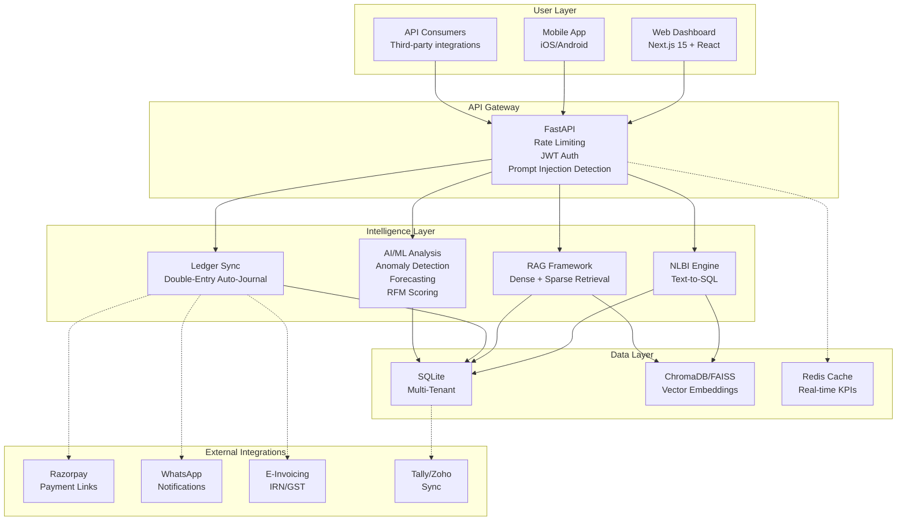

---

## 2. USER REGISTRATION & AUTHENTICATION FLOW

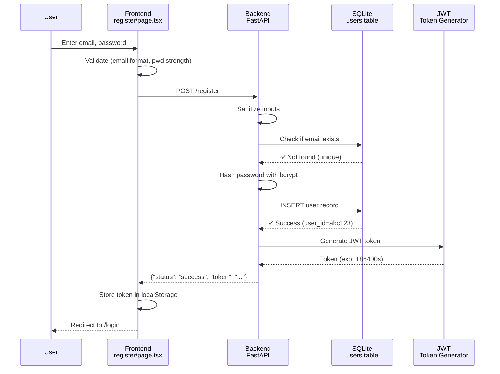

---

## 3. INVOICE CREATION & AUTO-JOURNALIZATION

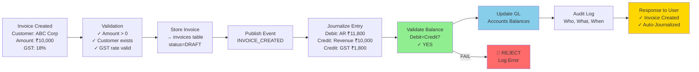

---

## 4. NATURAL LANGUAGE BUSINESS INTELLIGENCE (NLBI) FLOW

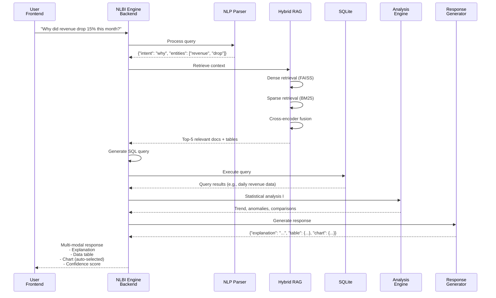

---

## 5. ANOMALY DETECTION PIPELINE

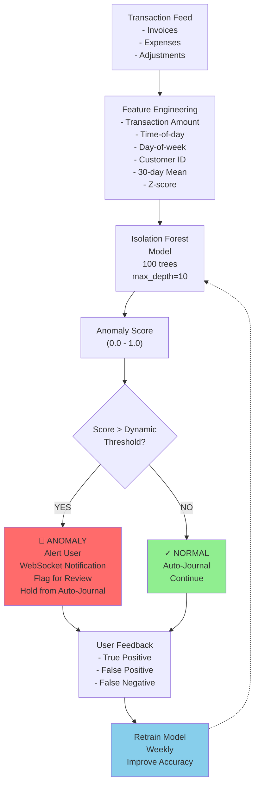

---

## 6. REVENUE FORECASTING (ARIMA + PROPHET)

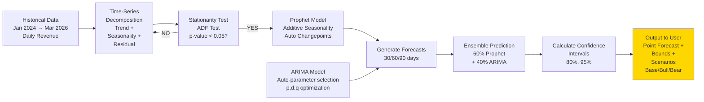

---

## 7. GENERAL LEDGER BALANCE VALIDATION

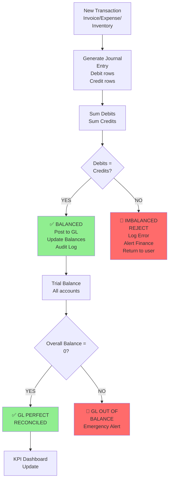

---

## 8. DATA INGESTION & ML PIPELINE

```mermaid
graph LR
    A["User Uploads<br/>CSV/Excel<br/>Max 50MB"]
    
    B["File Validation<br/>✓ Type check<br/>✓ Size limit<br/>✓ Malware scan"]
    
    C["Data Parsing<br/>- Detect encoding<br/>- Infer data types<br/>- Handle missing values<br/>- Normalize columns"]
    
    D["Schema Mapping<br/>Auto-categorize:<br/>INVOICE/CUSTOMER/<br/>INVENTORY/EXPENSE"]
    
    E["Transform<br/>- Deduplicate<br/>- Encrypt sensitive<br/>- Limit to 20K rows"]
    
    F["Background ML Job<br/>- Clustering<br/>- Normalization<br/>- Feature extraction<br/>- Statistical profiling"]
    
    G["Index & Search<br/>- ChromaDB vectors<br/>- SQLite FTS<br/>- Semantic index"]
    
    H["User Dashboard<br/>- Row count<br/>- Column analysis<br/>- Quality score<br/>- Visualization preview"]
    
    A --> B --> C --> D --> E
    
    E --> F
    F --> G --> H
    
    I["Data Ready for<br/>NLBI Queries"]
    H --> I
    
    style I fill:#FFD700
```

---

## 9. MULTI-TENANT ISOLATION ARCHITECTURE

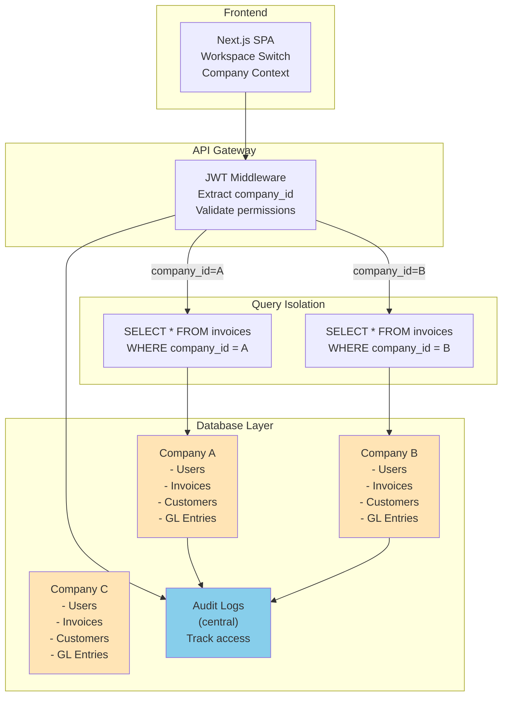

---

## 10. GST COMPLIANCE FLOW

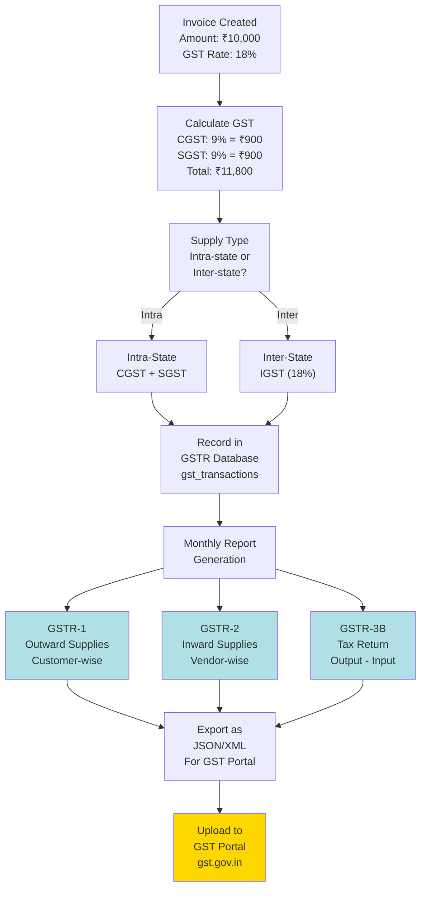

---

## 11. CUSTOMER CHURN PREDICTION

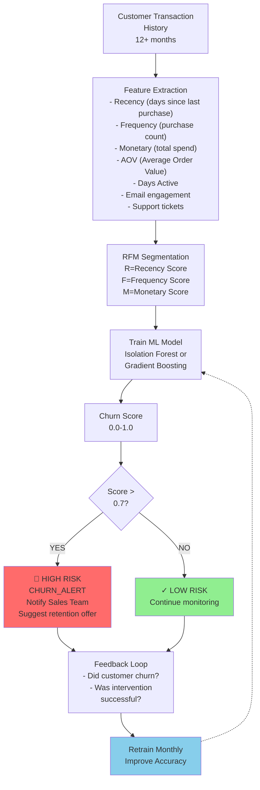

---

## 12. REAL-TIME KPI DASHBOARD (WebSocket Flow)

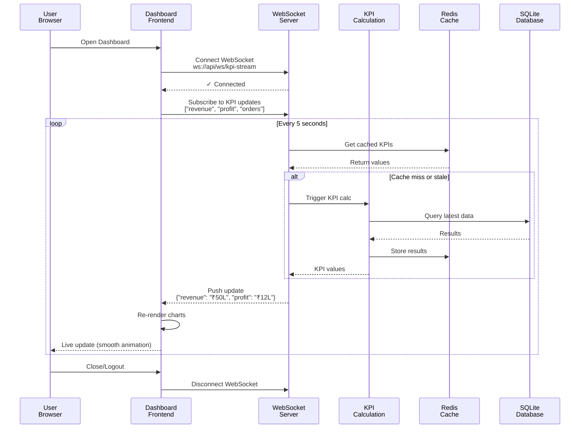

---

## 13. PAYMENT LINK & RECONCILIATION FLOW

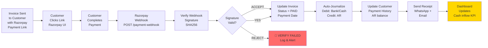

---

## 14. INVENTORY VALUATION & COGS FLOW

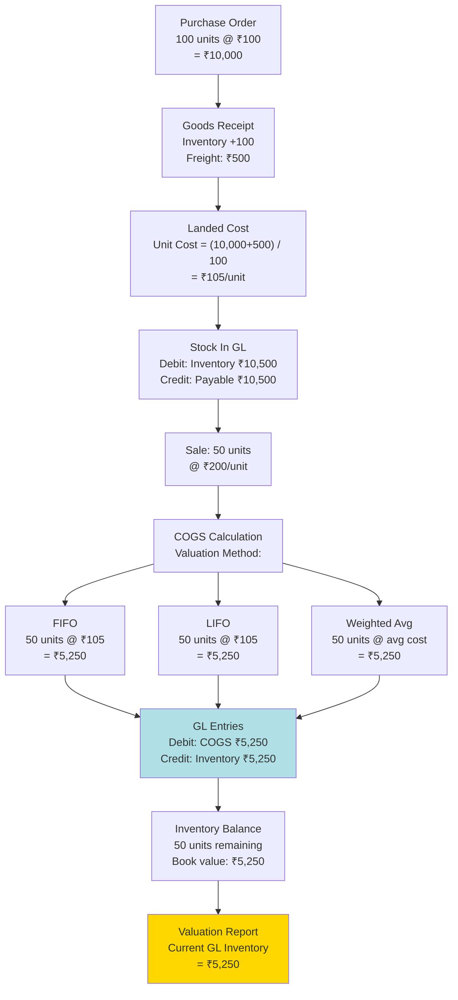

---

## 15. SYSTEM ERROR RECOVERY & ROLLBACK

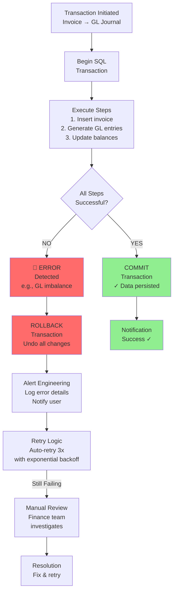

---

## 16. ROLE-BASED ACCESS CONTROL (RBAC)

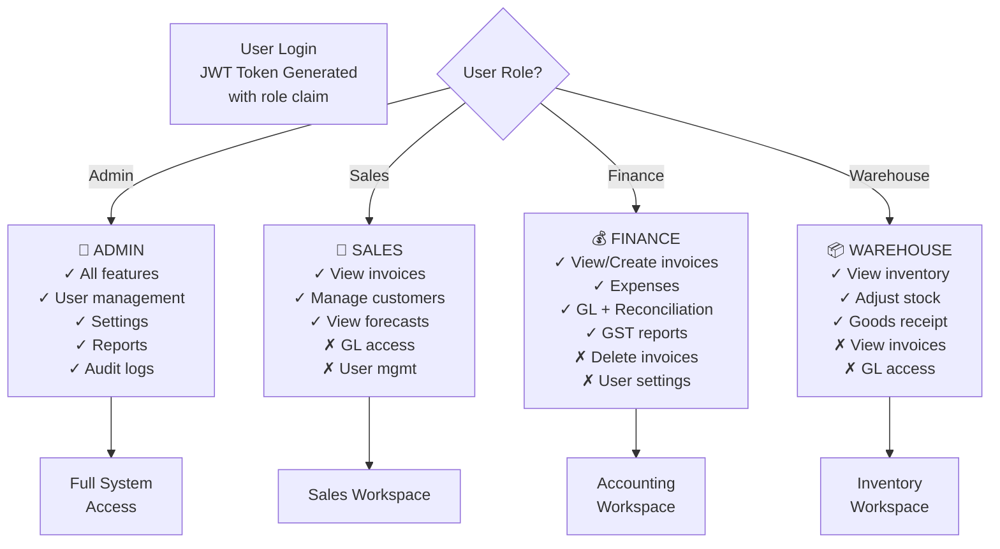

---

## 17. END-OF-MONTH CLOSE PROCESS

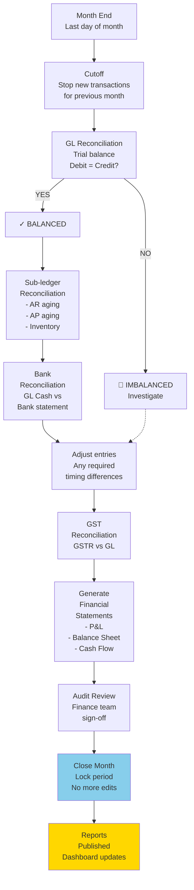

---

## 18. DISASTER RECOVERY & BACKUP

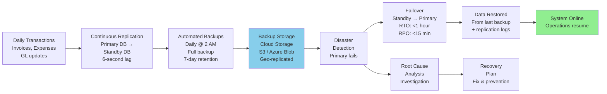

---

## KEY METRICS DASHBOARD

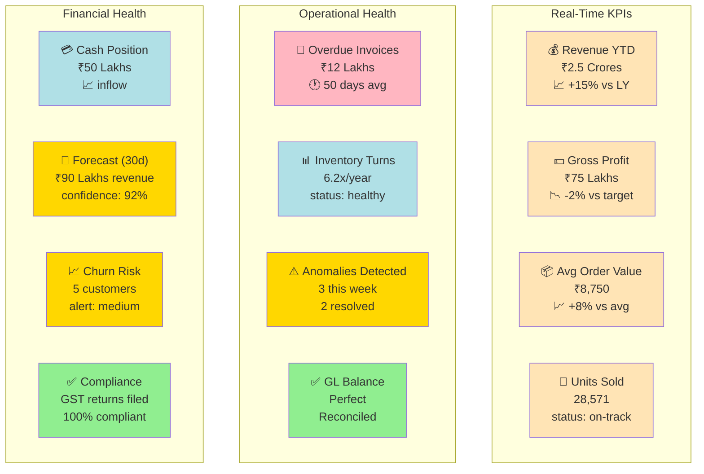

---

## DEPLOYMENT PIPELINE

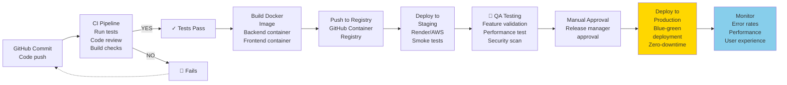

---

**END OF FLOWCHART DOCUMENTATION**

All diagrams are production-ready Mermaid syntax and can be stored in markdown files or rendered in documentation tools.

